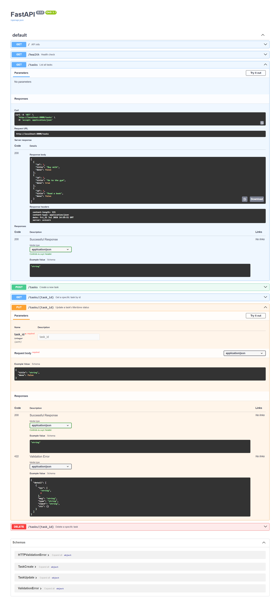

# Task API

A small in-memory CRUD API for managing a to-do list, built with FastAPI.
Data is stored only in memory (a Python list) — there is no database yet,
so restarting the server resets the task list back to the 3 seed tasks.

## How to run it

Requires Python 3.10+.

```powershell
python -m venv venv
venv\Scripts\activate
pip install fastapi "uvicorn[standard]"
uvicorn main:app --reload --port 8000
```

Then open:
- `http://localhost:8000/` — API info
- `http://localhost:8000/docs` — Swagger UI (interactive docs)

## Endpoints

| Method | Path            | Meaning                          | Success | Errors                     |
|--------|-----------------|-----------------------------------|---------|------------------------------|
| GET    | `/`             | API info                          | 200     | —                            |
| GET    | `/health`       | Health check                      | 200     | —                            |
| GET    | `/tasks`        | List all tasks                    | 200     | —                            |
| GET    | `/tasks/{id}`   | Get one task                      | 200     | 404 unknown id               |
| POST   | `/tasks`        | Create a task (`{"title": "..."}`)| 201     | 400 missing/empty title      |
| PUT    | `/tasks/{id}`   | Replace a task's title/done       | 200     | 400 bad body · 404 unknown id|
| DELETE | `/tasks/{id}`   | Remove a task                     | 204     | 404 unknown id               |

## Example: create a task

$ curl.exe -i -X POST http://localhost:8000/tasks -H "Content-Type: application/json" -d "{"title": "Buy milk"}"
HTTP/1.1 201 Created
content-type: application/json

{"id":5,"title":"Buy milk","done":false}

Posting an empty title returns `400` instead of creating a task.
`GET /tasks/99` (an id that doesn't exist) returns `404` with a JSON error.

## A note on Windows/PowerShell

Some `curl.exe` calls with a JSON body (`-d`) failed on this machine due to
PowerShell mangling the quote-escaping — a known PowerShell quirk, not a bug
in the API. Those requests were tested instead with PowerShell's native
`Invoke-WebRequest`, e.g.:

```powershell
Invoke-WebRequest -Uri "http://localhost:8000/tasks/1" -Method Put -ContentType "application/json" -Body '{"title":"Buy oat milk","done":true}' -UseBasicParsing
```

## Swagger UI

`/docs` is generated automatically by FastAPI from the code. Every endpoint
above is listed there with a "Try it out" button that sends real requests.



## The mortality experiment

Create a task, then restart the server (stop it with Ctrl+C, run
`uvicorn main:app --reload --port 8000` again), then `GET /tasks`. The list
goes back to just the 3 seed tasks — everything created while the server was
running is gone, because the data only ever lived in a Python list in
memory, not on disk. Restarting the process wipes the variable along with
it. This is exactly why a real database matters — it's the thing that
survives a restart.